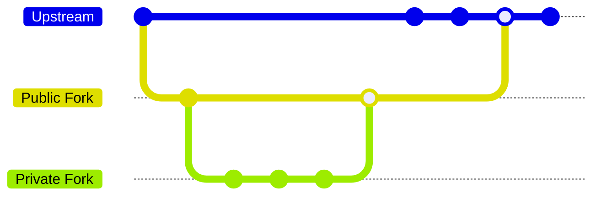

<h1 align="center">
  Internal Contribution Forks
</h1>

<h4 align="center">A GitHub App that allows you to contribute upstream using a 'private fork'</h4>

<p align="center">
  <a href="#key-features">Key Features</a> •
  <a href="#usage">Usage</a> •
  <a href="#developing">Developing</a> •
  <a href="#background">Background</a> •
  <a href="#license">MIT License</a>
</p>

This is a Next.js project with an accompanying GitHub App that allows you to contribute to an upstream project using a private repository in your own organization. This is useful for organizations that want to keep their code private and perform their own checks before making any code changes public.

> [!IMPORTANT]
> 📣 EMU support is now available! Check out the [hosting - GHEC](#integrating-the-app-into-ghec) section for more information.
>
> This app is still a work in progress and is not considered stable just yet. We still recommend trying out the app because [we'd love to hear from you](https://github.com/github-community-projects/internal-contribution-forks/issues/new)!

## Background

Enterprises struggle with how to let their developers contribute to open source projects. Most are not opposed, in principle, to contributing back to the projects they rely upon. Many are enthusiastic about becoming better open source citizens, and understand the reputational and technical benefits that working in open source can accrue to the business. However, real and perceived security concerns make this process difficult at best and impossible at worst for companies.

To succeed, open source advocates and OSPOs need to address their stakeholders' concerns about:

- Credential leaks
- Intellectual property leaks
- PII / PHI disclosure
- Liability and/or reputational damage resulting from bad code

Solving these concerns creates opportunities for enterprise development teams to participate more deeply in open source and foster a collaborative relationship with the open source community.

> Internal Contribution Forks (ICF) is a GitHub app paired with a UI that manages the lifecycle of private mirrors, as well as the synchronization of code between the public fork of an upstream project and the private mirrors where the enterprise teams are working.

## Key Features

- Piggybacks off native GitHub fork network functionality to allow you to contribute to an upstream project using a private repository in your own organization
- No commit rewriting — keep commit history, author attributions, commit signing and other metadata intact
- No datastore — no need to worry about storing your code on a third-party server
- Reduces risk of making open source contributions to upstream projects because your work stays private until it passes approval
- Adapt the app to your workflow to ensure approvals, checks, and other requirements are met before code is merged upstream
- Works with GitHub Enterprise Managed Users (EMUs) and GitHub Enterprise Cloud (GHEC)

High Level Flow:



The app uses an intermediary public fork to merge the private mirror into, and then enables the normal OSS contributor workflow into the upstream repository. This allows users to keep the private repo private while still allowing us to contribute to the upstream repository. Check out this [application flow diagram](./docs/architecture.md) for a more detailed look at how the app works.

## Hosting

You'll need to self-host the app. See the section on [Developing](#developing) for more information.

This app was created with the idea of self-hosting in mind and can be deployed to any hosting provider that supports Next.js/Docker.

You will still need to create a GitHub App and configure it to point to your deployment. See the [Developing — GitHub App](#github-app) section for more information.

```sh
docker build -t internal-contribution-forks .
docker run --env-file=.env -p 3000:3000 internal-contribution-forks

# alternatively, you can use docker compose
docker compose up
```

We recommend using Node 20.x or higher, though any Node LTS version >18 should work.

## Integrating the App into GHEC

The app can be integrated into GitHub Enterprise Cloud (GHEC) by following the same steps as GitHub.com. The app is designed to work with GHEC and GitHub Enterprise Managed Users (EMUs).

The only tradeoff is that a single **App instance will only work between a single GitHub instance and a single GHEC instance**. If you have multiple GitHub instances and GHEC instances, you will need to deploy multiple instances of the app.

To enable the app to work with GHEC, you will need to set the following environment variables in addition to installing the App on your GHEC organization instance.

```sh
PUBLIC_ORG=name-of-your-public-org    # Where your public forks will be created
PRIVATE_ORG=name-of-your-ghec-org     # Where your private mirrors will be created
```

The authentication of the UI will still need to be a user's github.com user, but the app will be able to create forks and mirrors in the GHEC instance.

## Usage

Once the app is installed, follow this document on [Using the ICF App](docs/using-the-app.md) to get the repository fork and mirrors set up for work.

## Developing

### Environment

Create a new `.env` file from the `.env.example` file

```sh
cp .env.example .env
```

### GitHub App

1. Create a new GitHub App [here](https://github.com/settings/apps/new)
2. There's an App manifest in the repo that lays out all the permissions and webhook events needed and can be found [here](./app-manifest.yml).
3. Copy all the secrets, credentials, and IDs into the `.env` file

### Webapp

This is a webapp built with Next.js. You can find the Next.js documentation [here](https://nextjs.org/docs).

#### Install dependencies

```sh
npm i
```

#### Start the application

```sh
npm run dev
```

You should be up and running on [http://localhost:3000](http://localhost:3000)!

#### Testing Webhooks

Webhooks are an important part of this application, they listen for events that happen to your organization and trigger the app to do things like create branch protections or sync code between forks.

You can use [smee.io](https://smee.io) to test webhooks locally. [ngrok](https://ngrok.com/) is another option.

For smee: Go to [smee.io](https://smee.io/new), this will create a new URL for you to use. e.g. `https://smee.io/AbCd1234EfGh5678`.

Copy the URL and paste it into the `WEBHOOK_PROXY_URL` environment variable in `.env`.

### GitHub Requirements

We recommend that you have a dedicated GitHub organization for your contributions. This will allow you to keep your contributions separate from your organization's daily operations.

> We have added support for GitHub Enterprise Managed Users (EMUs) and GitHub Enterprise Cloud (GHEC) in the app. If you are using GitHub Enterprise, you will need to make sure that the app is installed on your GitHub Enterprise instance.

Permissions:

- The GitHub App must be installed on the organization(s) you plan on contributing from
- Currently, any member of the organization can access the app and create additional private mirror repositories

## License

This project is licensed under the terms of the MIT open source license. Please refer to [MIT](./LICENSE.md) for the full terms.

## Maintainers

Check out the [CODEOWNERS](./CODEOWNERS) file to see who to contact for code changes.

## Support

If you need support using this project or have questions about it, please [open an issue in this repository](https://github.com/github-community-projects/internal-contribution-forks/issues/new) and we'd be happy to help. Requests made directly to GitHub staff or the support team will be redirected here to open an issue. GitHub SLA's and support/services contracts do not apply to this repository.

## More OSPO Tools

Looking for more resources for your open source program office (OSPO)? Check out the [`github-ospo`](https://github.com/github/github-ospo) repo for a variety of tools designed to support your needs.
