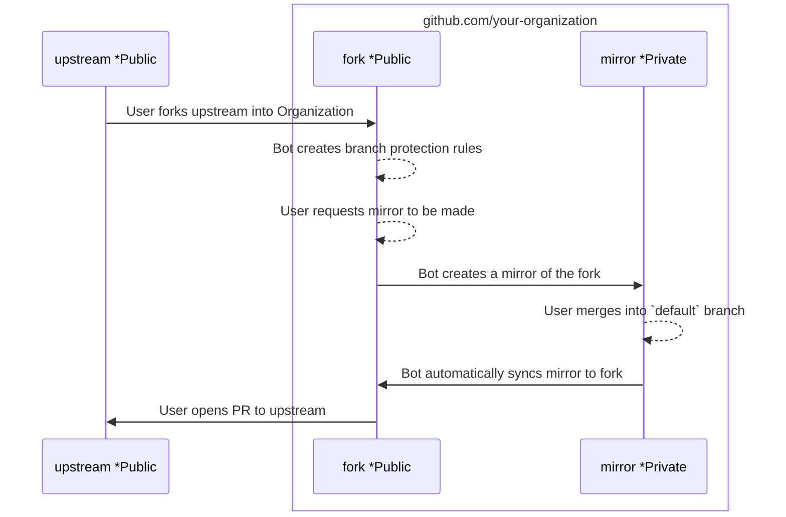

# Architecture

## Overview

The project is a Node.js application that uses the [Probot framework](https://probot.github.io/) to listen for events from GitHub. It uses a GitHub App to perform elevated actions on behalf of the user while the user has little or no permissions at all.

## Sequence Diagram

## Components

### UI

The UI is built in nextjs with React Typescript. The main purpose of the UI is to provide a way for the user to request a mirror repository to be created. Every other part of the workflow can be achieved in GitHub or with the git CLI.

### GitHub App

The GitHub App is the main component of the project. It is responsible for listening to events from GitHub and performing actions on behalf of the user. It is also responsible for creating the mirror repository and syncing all changes between the fork and the mirror.

### Node Server

As part of the nextjs framework, it exposes a Node server we can use to run the GitHub App. This is the entry point for the application. It is responsible for loading the GitHub App and starting the server as well as performing git operations.
