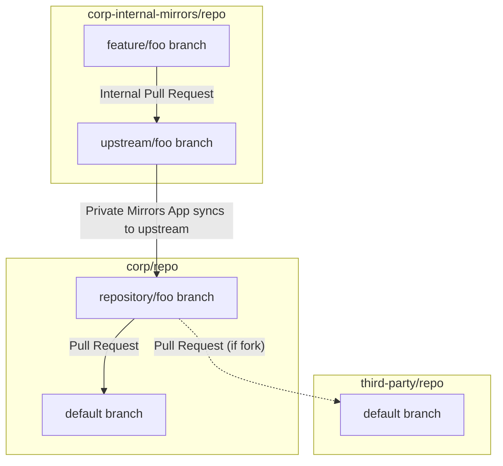

# Private Mirrors App

This app enables development of public repositories in a private context.

## Concepts

### Upstream/Downstream Repositories

Every repository using this app is part of a pair of repositories (called `upstream` and `downstream`).
The `downstream` repository is where feature development happens (in private).
Features are 'released' from the `downstream` repository to branches in the `upstream` repository.

A given `upstream` could have multiple `downstream` repositories (though this should not be necessary), but a `downstream` repository can only have one `upstream` repository.

### Root Repository

The `upstream` repository could be a fork of another repository (which may itself be a fork).
In this case, contributions to the `upstream` repository are likely intended to be contributions to some repository in its network of forks (the `root` repository).

If the `upstream` repository is NOT a fork, then the `root` repository is the same as the `upstream` repository.

### Branch Conventions

The `downstream` repositories have a very strict branch convention:

- `root` - The `root` branch follows the default branch of the `root` repository. This provides:
  1. A starting point for upstream branches.
  2. A convenient point to branch from when making new feature branches.
  3. A good choice of default branch for the `downstream` repository.
- `feature/<feature>` - The feature branches represent internal development on the `downstream` repository. Contents of these branches are not directly reflected on the `upstream` repository.
- `upstream/<feature>` - An `upstream/` branch is created whenever a `feature/` branch is created. It is initialised to the current HEAD of the `root` branch.

The `upstream` repositories also have a (less strict) branch convention:

- `<downstream repo>/<feature>` - These follow the `upstream/` branches in `downstream` repositories.

## Repository Setup

### Creating an `upstream` repository

An `upstream` repository can be any public repository in an organization where the app is installed. It does not need any special configuration.

### Creating a `downstream` repository

To designate a repository as a `downstream` repository, set its `upstream-repository` custom repository property to the (HTTP) clone URL of the repository you want to use as the `upstream`. For GitHub `upstream` repositories, a short-form of `<owner>/<repository>` may be used. Currently, only GitHub repositories are supported as upstreams.

> Beware, setting the `upstream-repository` custom property will overwrite branches to configure the repository as a `downstream` repository, and may incur data loss.

### Setting the `root` repository

When the `upstream` repository is a fork, the app assumes that the `root` repository is the parent repository in the chain of forks. That is, navigate up the 'fork-of' relationship chain until you reach a non-fork repository.

This may not always be the intended `root` repository. The `root-repository` custom repository property can be used to directly set the `root` repository. Similar to the `upstream-repository` property, this takes (HTTP) clone URL or `<owner>/<repository>`.

## Developing Features

The process below uses the following assumptions:

- The feature name is `foo`. In reality, this would be more descriptive.
- The downstream repository is `corp-internal-mirrors/repo`.
- The upstream repository is `corp/repo`.
- If there is an upstream fork, it is `third-party/repo`.

### High Level Diagram

### Create the feature branch

1. Ensure the `root` branch of the downstream repository is in sync with the `root` repository. Use the `Resync` button in the GitHub check of the HEAD of the `root` branch if necessary.
2. Checkout the `root` branch of the `downstream` repository.
3. Create a feature branch: `git branch feature/foo`.
4. Develop your feature, and commit: `git commit`.
5. Push your feature: `git push`.

Observe that pushing the `feature/` branch caused:

- An `upstream/foo` branch to be created in the `downstream` repository.
- A `repo/foo` branch to be created in the `upstream` repository.

Also note that your feature is not on either of the branches above.

### Pushing the feature to the upstream repository.

1. Create a Pull Request on the `downstream` repository from `feature/foo` to `upstream/foo`.
2. Get the Pull Request approved and merged.

Observe that your feature is now present on:

- The `upstream/foo` branch in the `downstream` repository
- The `repo/foo` branch in the `upstream` repository.

### Contributing the feature to the root repository.

At this point, the app is no longer involved in the process.
The feature is available to be referenced as a normal Pull Request on github.com.
However, the steps below are mentioned for completeness.

These operations will need to be performed as a github.com (not EMU) user.
They do NOT require you to be a member of the organization containing the `upstream` repository though.

1. Create a Pull Request from the `repo/foo` branch of the `upstream` repository to the default branch of the `root` repository (`root` and `upstream` repositories may be the same).
2. Get the Pull Request approved and merged.

### Cleaning up

Once the contribution is accepted, it is common to remove the `repo/foo` branch from the `upstream` repository.
After that, it is recommended to remove the `feature/foo` and `upstream/foo` branches from the `downstream` repository.

## Exceptions

Sometimes the process is not as smooth as the one described above.
Here are some anticipated exceptions, and recommended approaches to resolving them.

### Root branch changes

If the process above takes some time, and the `root` repository's default branch changes (especially in ways that cause merge conflicts), then those changes will need to be included in your branch.

1. Find the 'Sync' check suite for the `root` branch of the `downstream` repository.
2. Click the 'Resync' button. This will update the `root` branch to match the default branch of the `root` repository.
3. Checkout the `feature/foo` and `root` branches of the `downstream` repositories.
4. Rebase the `feature/foo` branch on top of the updated `root` branch.
5. Push the changes to `feature/foo`.
6. Create a Pull Request from `feature/foo` to `upstream/foo` in the `downstream` repository.
7. Get the Pull Request approved and merged.

Observe that merging the Pull Request applies the change to the `my-mirror/foo` branch.

### Feature updates

You may find that the feature requires some modification before it is accepted as a contribution to the `root` repository. In this case you would:

1. Checkout the `feature/foo` branch of the `downstream` repository.
2. Make and commit your changes.
3. Push the changes to the `feature/foo` branch of the downstream repository.
4. Create a Pull Request from `feature/foo` to `upstream/foo` in the `downstream` repository.
5. Get the Pull Request approved and merged.

Observe that merging the Pull Request applies the change to the `my-mirror/foo` branch.

### Combining changes in the fork

If you have multiple changes being contributed to an upstream repository, it may be convenient to merge them into the `upstream` repository's default branch, to give you a place to reference a (completely) patched repository.
