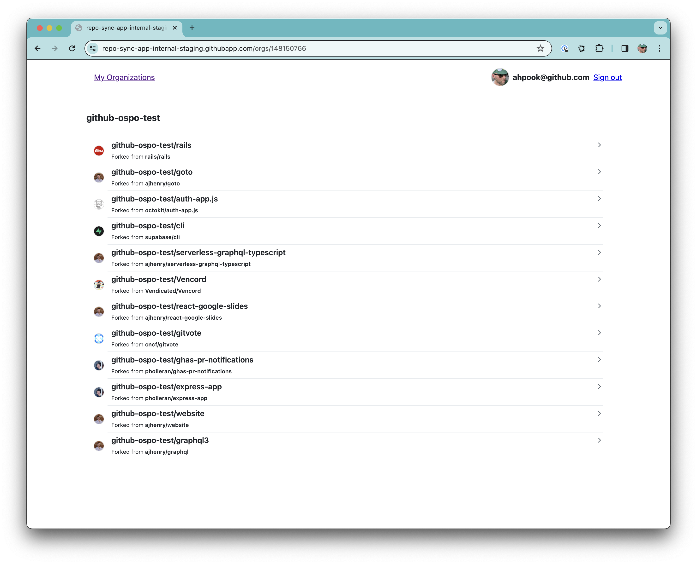
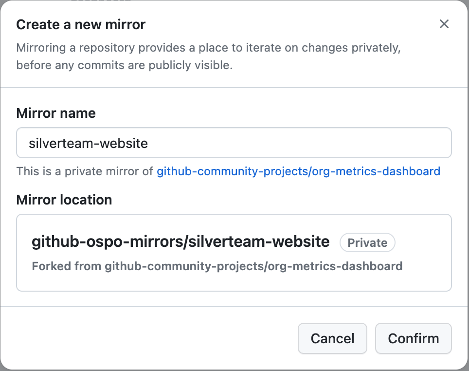
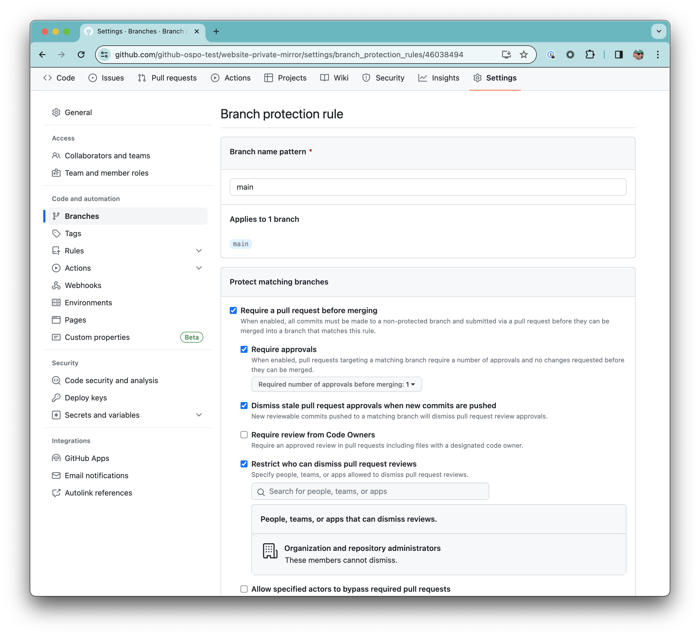

## How to get started working with the GitHub Private Mirrors App (PMA)

1. Set up an organization to host your open source work. Many enterprises use a primary organization which mainly contains private repos or company-wide projects owned by the enterprise. Creating a separate organization which hosts your open-source efforts - both forks of upstream projects in use for this app, as well as open projects that expect a lot of external collaborators - makes for cleaner administrative/security boundaries.

2. Install the app into that organization. Currently you'll need to self-host the application, following the [instructions in the project's README](../README.md), but we are working towards a hosted solution as well - if this is a blocker for you please comment on [this issue](https://github.com/github-community-projects/private-mirrors/issues/122) to register your interest and say more about your use case.

3. Fork an upstream project into the organization's namespace. This will create your **public fork**. A decision point for administrators is whether to permit any user to fork new projects into the organizations, or restrict the ability to fork. These permissions are managed by [the organization's forking policy](https://docs.github.com/en/enterprise-cloud@latest/organizations/managing-organization-settings/managing-the-forking-policy-for-your-organization). A more permissive posture can lower the barrier to contribution, but be careful not to circumvent company policy on approving upstream work.

4. Go the app's URL and authenticate to it. If your account is in the list of allowed usernames, you'll see a list of your organizations that the app is managing. Click on your org's name and you'll see a list of all the public forks in the organization.

   

5. Click on the name of the public fork you just created. Click **Create mirror** and give it an unambiguous name, then click **Confirm**. This will create a **private mirror** of the repo. The app syncs commits on the private mirror's default branch to a new branch on the public fork. For example, the default branch of a private mirror named `silverteam-website` will be synced to a branch named `silverteam-website` on the public fork. So it's a good idea to be verbose in your name and describe how this fork will be used. PMA's workflow supports multiple private mirrors per public fork, to enable different individuals or teams to work on the default branches of their respective mirrors without interefering with each other.

   

6. As the app creates the private mirror, it also adds some basic branch protection rules to require approvals before merge, but you'll likely want to customize these with additional checks to meet your internal requirements for compliance or IP review. Go to the newly-created mirror's **Settings** page and add or modify the rules under **Branches**.

The mirror should now be ready for PRs!

## PR workflow once a mirror is active

1. Create a pull request against the private mirror repo

2. Review and merge the PR – at this step, if issues come up that require the deletion of code in the PR, you should either

   1. [Squash and merge the pull request](https://docs.github.com/en/pull-requests/collaborating-with-pull-requests/incorporating-changes-from-a-pull-request/about-pull-request-merges#squash-and-merge-your-commits) to "squash history" so the merge commit does not contain traces of the sensitive data
   1. [Rewrite any commits on the pull request](https://git-scm.com/book/en/v2/Git-Tools-Rewriting-History) to remove any sensitive data from the PR entirely

   Review the [security implications for contributions synced to public forks](#security-implications-for-contributions-synced-to-public-forks) for more information.

3. Once it's merged, the app will automatically sync the private mirror to your public fork, updating a branch whose name matches the name of the private mirror (`silverteam-website`, in this example).

4. You can then use that branch of the public fork as the base to open a PR to the upstream repository.

## Security implications for contributions synced to public forks

Private Mirrors App is designed to help you manage your open source contributions in a way that addresses stakeholder concerns and conforms to your organization's security and compliance requirements. Contributions using PMA are first made to a private mirror, which is detached from the repository and forks (i.e. the [repository network](https://docs.github.com/en/repositories/viewing-activity-and-data-for-your-repository/understanding-connections-between-repositories)) on GitHub. This allows sensitive data or credentials to be caught in a private mirror before any commits are synced back to a public fork. Be sure to remove any sensitive data or credentials  from the commit history before syncing the contribution back to a public fork.

Once a contribution is synced back to a fork, keep these security implications in mind.

- Forks are [visible to anyone who can access the upstream repository](https://docs.github.com/en/pull-requests/collaborating-with-pull-requests/working-with-forks/about-permissions-and-visibility-of-forks#about-visibility-of-forks).
- Commits to a fork are visible to anyone who can access the upstream repository, [even if the fork is deleted](https://docs.github.com/en/pull-requests/collaborating-with-pull-requests/working-with-forks/about-permissions-and-visibility-of-forks#important-security-considerations).
- If a private repository is made public, [all commits in the repository and any commits previously pushed to private forks of that repository will become publicly visible](https://docs.github.com/en/pull-requests/collaborating-with-pull-requests/working-with-forks/what-happens-to-forks-when-a-repository-is-deleted-or-changes-visibility#changing-a-private-repository-to-a-public-repository).

For these reasons, for any commits synced to a public fork that accidentally include sensitive data or credentials, the sensitive data or credentials should be considered compromised. **Deleting the fork or removing the commits from the fork's history will not remove the data from the upstream repository.**

We strongly recommend having security procedures prepared and in place in case of any accidental leaks. For example, immediately rotate any cloud API credentials that are exposed. Consult with your security team to determine the necessary security procedures for your organization.
